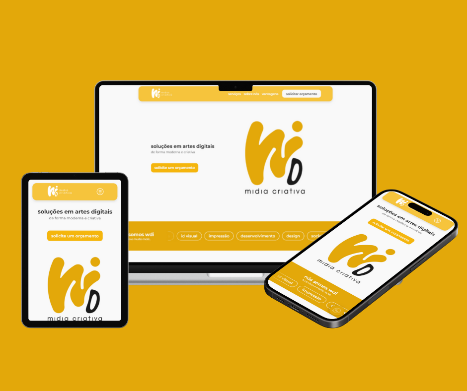

# 🚀 wdi midia criativa - Landing Page  

Bem-vindo ao repositório da **Landing Page** da agência de marketing **wdi**! 🎯✨  

Este projeto tem como objetivo criar uma **landing page moderna, responsiva e interativa**, inicialmente utilizando **HTML, CSS e JavaScript**. Posteriormente, será aprimorado com **React** para adicionar dinamismo e melhorar a experiência do usuário.  

---

## 🛠 **Tecnologias Utilizadas**  

Atualmente, o projeto está sendo desenvolvido com:  
✅ **HTML5** → Estrutura semântica e acessível.  
✅ **CSS3** → Estilização moderna e responsiva.  
✅ **JavaScript (ES6+)** → Interatividade básica.  
✅ **Formspree** → Integração simples de formulário com e-mail para captação de leads.  
✅ **Vercel** → Deploy automático.

---

## 📱 **Responsividade**

O site foi projetado com **mobile-first** em mente e funciona perfeitamente em todos os tamanhos de tela. 📲💻

---

📌 **Futuras implementações**:  
🔹 **Vue.js** → Para componentes reutilizáveis e maior dinamismo.  
🔹 **Animações avançadas** → Utilizando bibliotecas como Framer Motion ou GSAP.  

---

🖼 Mockups / Screenshots


---

## 📂 **Estrutura do Projeto**  

A organização dos arquivos segue a seguinte estrutura:  
```
📦 wdi-lp │── 📜 README.md # Documentação do projeto
│── 📜 index.html # Estrutura principal da página
│── 🎨 style.css # Estilos e responsividade
│── ⚡ script.js # Funcionalidades interativas
└── 📂 assets # Imagens e elementos gráficos
```


---

## 🎯 **Objetivos do Projeto**  

✅ Desenvolver uma **landing page profissional** para a agência **wdi**.  
✅ Aplicar boas práticas de **UX/UI design** e **SEO**.  
✅ Aprofundar conhecimentos em **desenvolvimento web** e **autonomia em projetos**.  
✅ Aprofundar conhecimentos em **Vue.js** e componentização.  
✅ Captar leads com **formulário integrado via Formspree**.  
✅ Aprimorar a autonomia no desenvolvimento web do zero ao deploy. 

---

## 📌 **Como Rodar o Projeto?**

1️⃣ Clone este repositório:  
```
bash
git clone https://github.com/edrda/wdi-lp.git
```
2️⃣ Acesse a pasta do projeto:
```
cd wdi-lp
```
3️⃣ Abra o arquivo index.html no navegador.

---

## 📅 **Próximos Passos**
- Implementação de animações suaves e interações.
- Conversão para Vue.js para maior escalabilidade.
- Otimização para melhor desempenho e SEO.
- Testes de acessibilidade e responsividade.


## 💡 **Considerações Finais**
Este projeto tem sido uma grande oportunidade de aprendizado e crescimento pessoal e profissional, permitindo que eu desenvolva habilidades essenciais para o mercado de desenvolvimento web. 🚀

---

📌 Feito com 💚 e dedicação!
